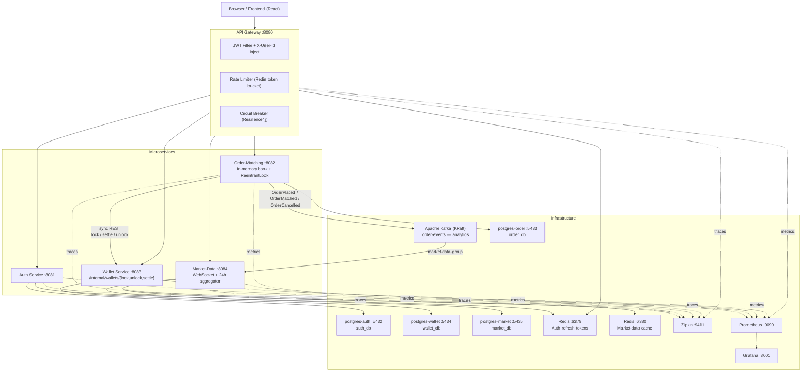

# Crypto Exchange Platform

[](https://github.com/Serhii-Leniv/crypto-platform/actions/workflows/ci.yml)
[](https://openjdk.org/projects/jdk/21/)
[](https://spring.io/projects/spring-boot)
[](https://spring.io/projects/spring-cloud)
[](https://kafka.apache.org/)
[](https://www.postgresql.org/)
[](https://redis.io/)
[](https://docs.docker.com/compose/)
[](k8s/)
[](LICENSE)

A **production-grade cryptocurrency exchange platform** built on a microservices architecture. The system handles user authentication, real-exchange order placement (LIMIT / MARKET / STOP_LIMIT with GTC, IOC, FOK, POST_ONLY time-in-force), price-time-priority matching with self-trade prevention, atomic synchronous wallet settlement, and real-time market data over WebSocket — with Apache Kafka used as an informational analytics stream.

---

## Table of Contents

- [Key Features](#key-features)
- [Architecture](#architecture)
- [Technology Stack](#technology-stack)
- [Quick Start](#quick-start)
- [API Reference](#api-reference)
- [Order Matching](#order-matching)
- [Design Decisions](#design-decisions)
- [Observability](#observability)
- [Kubernetes](#kubernetes)
- [Local Development](#local-development)
- [Environment Variables](#environment-variables)
- [Project Structure](#project-structure)

---

## Key Features

| Feature | Details |
|---|---|
| **JWT Authentication** | Stateless access tokens (15 min) + httpOnly refresh-token cookie with rotation (7 days) |
| **Real-Exchange Matching** | Price-time-priority in-memory order book — `LIMIT`, `MARKET`, `STOP_LIMIT`; `ReentrantLock` per symbol |
| **Time-in-Force** | `GTC` (default), `IOC`, `FOK`, `POST_ONLY` — all enforced before / after match with compensating unlocks |
| **Synchronous Fund Lock** | Order-matching calls wallet-service `/internal/wallets/lock` via REST **before** the order enters the book — no trading on credit |
| **Atomic 4-Wallet Settlement** | A single `@Transactional` `/internal/wallets/settle` moves base + quote between buyer and seller and applies maker/taker fees |
| **Self-Trade Prevention** | Matching engine skips counterparties owned by the same user |
| **Maker / Taker Fees** | Configurable per trading pair in basis points (bps), deducted from the received asset |
| **Trading-Pair Registry** | DB-backed whitelist with `tick_size` and `min_quantity` validation on every order |
| **Stop Orders** | `STOP_LIMIT` parked as `TRIGGER_PENDING`; `StopOrderMonitor` activates when market price crosses `trigger_price` |
| **Buyer-Slippage Refund** | Settlement unlocks the difference between buyer limit price and execution price on every fill |
| **Demo Seed** | `SPRING_PROFILES_ACTIVE=dev` seeds 3 users (alice/bob/charlie, `Password1`), wallets, trading pairs, and open orders |
| **WebSocket Market Data** | STOMP over SockJS — `/topic/orderbook/{symbol}`, `/topic/trades/{symbol}`, `/topic/market-data` |
| **Truthful 24 h Stats** | Aggregated from a `trades` table every 30 s, cached in Redis with midnight eviction |
| **Circuit Breaker** | Resilience4j circuit breakers on all gateway routes — fail-fast with graceful fallbacks |
| **Distributed Tracing** | Micrometer Tracing + Zipkin — full request trace across every microservice |
| **Rate Limiting** | Redis-backed token-bucket rate limiter on auth endpoints at the gateway |
| **API Gateway** | Single entry point — JWT filter, `X-User-Id` injection, CORS, rate limiting, circuit breaker |
| **Virtual Threads** | All four WebMVC services run on Java 21 virtual threads |
| **Flyway Migrations** | Versioned schema + repeatable seed scripts on every service DB |
| **DLQ + Replay** | Kafka business failures retried with exponential backoff, then routed to DLT; failed events visible in the admin panel for manual replay |
| **OpenAPI / Swagger UI** | Interactive docs at `/swagger-ui.html` on every service |
| **Prometheus + Grafana** | Pre-provisioned metrics dashboard, one `docker compose up` away |
| **Fully Dockerized** | One-command startup — infra and all five services + frontend |
| **Kubernetes Ready** | Deployment manifests, Services, and Ingress in `k8s/` |

---

## Architecture



### Request Flow

1. Every request hits the **API Gateway** (`8080`). Public routes (`/api/v1/auth/**`, `/api/v1/market-data/**`) bypass JWT validation.
2. `JwtAuthenticationFilter` validates `Authorization: Bearer <token>` and injects an `X-User-Id` header downstream.
3. Each route is wrapped in a **Resilience4j circuit breaker** — if a downstream is unhealthy, the gateway short-circuits to a fast `503`.
4. **Order placement is synchronous end-to-end**: `OrderService` pre-generates the order ID, calls `walletClient.lock()` (REST → wallet `/internal/wallets/lock`), then inserts into the in-memory book, then matches under the per-symbol lock. Each match calls `walletClient.settle()` which performs the atomic 4-wallet transfer (buyer-base, buyer-quote, seller-base, seller-quote + fees) in a single wallet-service transaction.
5. Kafka events (`order-events`) are emitted **after** the in-memory state is consistent — they are an informational stream consumed by `market-data` for analytics. The wallet service no longer consumes order events (its listener is a deliberate no-op, kept for consumer-group offset hygiene).
6. Micrometer Tracing injects `traceId`/`spanId` headers across every hop (HTTP and Kafka). Spans are exported to **Zipkin**.

---

## Technology Stack

| Layer | Technology |
|---|---|
| Language | Java 21 (virtual threads enabled) |
| Framework | Spring Boot 3.4.5 |
| API Gateway | Spring Cloud Gateway 2024.0.1 |
| Security | Spring Security + JWT (JJWT 0.12.6) |
| Fault Tolerance | Resilience4j (circuit breaker + time-limiter) |
| Messaging | Apache Kafka — Confluent Platform 7.8 KRaft |
| Persistence | Spring Data JPA + PostgreSQL 15 |
| Schema Migrations | Flyway (all services) |
| Caching | Spring Data Redis 8 |
| Object Mapping | MapStruct 1.6.3 + Lombok 1.18.36 |
| Tracing | Micrometer Tracing + Zipkin (Brave) |
| Metrics | Micrometer + Prometheus + Grafana |
| Containerization | Docker + Docker Compose |
| Orchestration | Kubernetes (manifests in `k8s/`) |
| Build Tool | Maven (multi-module) |
| API Docs | SpringDoc OpenAPI 2.8.6 (Swagger UI) |
| Frontend | React 19 + TypeScript + TailwindCSS + Vite |

---

## Quick Start

### Prerequisites

- Docker and Docker Compose
- Java 21+ (local development only)
- Maven 3.9+ (local development only)

### Run with Docker Compose

```bash
# 1. Clone the repository
git clone https://github.com/Serhii-Leniv/crypto-platform.git
cd crypto-platform

# 2. Configure environment
cp .env.example .env
# Set JWT_SECRET_KEY to a random string of at least 32 characters

# 3. Build and start all services
docker compose up --build
```

All microservices start after the infrastructure (4× Postgres, 2× Redis, Kafka) reports healthy. The demo seed (`SPRING_PROFILES_ACTIVE=dev`) runs automatically via Flyway repeatable migrations on first boot.

**Demo credentials** (all passwords are `Password1`):

| Email | Role |
|---|---|
| `alice@demo.io` | Admin (sees the admin panel + failed-events DLQ) |
| `bob@demo.io` | Trader |
| `charlie@demo.io` | Trader |

### Verify the Stack

```bash
# Public endpoint — no token required
curl http://localhost:8080/api/v1/market-data

# Register a user
curl -X POST http://localhost:8080/api/v1/auth/register \
  -H "Content-Type: application/json" \
  -d '{"email":"user@example.com","password":"secret123"}'

# Place an order (replace <token> with accessToken from register/login)
curl -X POST http://localhost:8080/api/v1/orders \
  -H "Authorization: Bearer <token>" \
  -H "Content-Type: application/json" \
  -d '{"symbol":"BTC-USDT","side":"BUY","orderType":"LIMIT","quantity":0.1,"price":45000}'
```

### Management UIs

| Tool | URL | Credentials |
|---|---|---|
| Frontend | http://localhost:3000 | — |
| pgAdmin 4 | http://localhost:5050 | admin@crypto.com / admin |
| Zipkin | http://localhost:9411 | — |
| Prometheus | http://localhost:9090 | — |
| Grafana | http://localhost:3001 | admin / admin |
| Swagger UI (Auth) | http://localhost:8081/swagger-ui.html | — |
| Swagger UI (Orders) | http://localhost:8082/swagger-ui.html | — |
| Swagger UI (Wallet) | http://localhost:8083/swagger-ui.html | — |
| Swagger UI (Market) | http://localhost:8084/swagger-ui.html | — |

---

## API Reference

All requests are routed through the **API Gateway** on port `8080`. Protected routes require `Authorization: Bearer <accessToken>`.

### Authentication — `POST /api/v1/auth`

| Method | Path | Auth | Description |
|---|---|---|---|
| POST | `/register` | No | Register a new user account |
| POST | `/login` | No | Authenticate and receive tokens |
| POST | `/refresh` | No | Obtain a new access token |
| POST | `/logout` | Yes | Revoke the current refresh token |

**Request body** (`/register`, `/login`):
```json
{ "email": "user@example.com", "password": "secret123" }
```

**Response**:
```json
{ "accessToken": "eyJ..." }
```

The **refresh token** is set as an `httpOnly`, `Secure`-on-prod cookie (`refresh_token`, `Path=/api/v1/auth`). The frontend never reads it from JS — `POST /api/v1/auth/refresh` restores the session from the cookie.

---

### Orders — `/api/v1/orders`

| Method | Path | Auth | Description |
|---|---|---|---|
| POST | `/` | Yes | Place a new order |
| GET | `/` | Yes | List all orders for the current user |
| GET | `/{orderId}` | Yes | Retrieve a specific order |
| DELETE | `/{orderId}` | Yes | Cancel an open order |
| GET | `/book/{symbol}` | Yes | Retrieve the live order book |

**Place order request body**:
```json
{
  "symbol":        "BTC-USDT",
  "side":          "BUY",
  "orderType":     "LIMIT",
  "quantity":      0.1,
  "price":         45000.00,
  "timeInForce":   "GTC",
  "triggerPrice":  null
}
```

- `side`: `BUY` | `SELL`
- `orderType`: `LIMIT` | `MARKET` | `STOP_LIMIT`
- `timeInForce` (LIMIT only): `GTC` (default) | `IOC` | `FOK` | `POST_ONLY`
- `triggerPrice`: required for `STOP_LIMIT`, otherwise null
- `symbol`: `BASE-QUOTE` or `BASE/QUOTE` (must exist in the `trading_pairs` registry; price must be a multiple of `tick_size`)
- `MARKET BUY` is rejected (no price ceiling to lock against); `MARKET SELL` is supported

**Error responses**:

| Status | Cause |
|---|---|
| `400 InvalidSymbol` | Symbol not listed, below `min_quantity`, or not a `tick_size` multiple |
| `409 Insufficient` | Wallet refused the synchronous lock |
| `409 PostOnlyRejected` | `POST_ONLY` order would cross the book |
| `409 FokRejected` | `FOK` order cannot be fully filled at placement |

---

### Wallets — `/api/v1/wallets`

| Method | Path | Auth | Description |
|---|---|---|---|
| POST | `/deposit` | Yes | Deposit funds into a wallet |
| POST | `/withdraw` | Yes | Withdraw funds from a wallet |
| GET | `/` | Yes | List all wallets for the current user |
| GET | `/transactions` | Yes | List all transactions |

**Deposit / Withdraw body**: `{ "currency": "USDT", "amount": 1000.00 }`

---

### Market Data — `/api/v1/market-data`

| Method | Path | Auth | Description |
|---|---|---|---|
| GET | `/` | No | List 24 h stats for all symbols |
| GET | `/{symbol}` | No | Get 24 h stats for a specific symbol |

WebSocket (STOMP over SockJS, served by `market-data` and `order-matching`):

| Topic | Source |
|---|---|
| `/topic/market-data` | Broadcast on every 24 h aggregator tick |
| `/topic/orderbook/{symbol}` | Broadcast on every book mutation |
| `/topic/trades/{symbol}` | Broadcast on every match |

### Admin — `/api/v1/admin`

Available to authenticated users; in `dev` profile the demo `alice` account is treated as admin.

| Method | Path | Description |
|---|---|---|
| GET  | `/failed-events` | Dead-letter queue: Kafka events that exceeded retries |
| POST | `/failed-events/{id}/replay` | Manually replay a single failed event |

**Response**:
```json
{
  "symbol": "BTC-USDT",
  "lastPrice": 45123.50,
  "openPrice24h": 44800.00,
  "high24h": 45500.00,
  "low24h": 44200.00,
  "volume24h": 123.456,
  "tradeCount24h": 87
}
```

---

## Order Matching

Price-time priority over an in-memory book. The path is fully synchronous so the API caller knows whether the order was accepted, rejected, locked, matched, and settled by the time the HTTP response returns.

### Place a LIMIT BUY at 45,000 USDT for 0.1 BTC-USDT

1. `OrderService.placeOrder()` validates the symbol against `trading_pairs` (whitelist, tick size, min quantity).
2. A fresh `orderId = UUID.randomUUID()` is generated locally so it can be referenced before persistence.
3. `walletClient.lock(userId, "USDT", 4500, orderId)` calls `POST /internal/wallets/lock` on wallet-service. The wallet service runs the lock inside a `@Transactional` `PESSIMISTIC_WRITE` and returns `200` or `409 Insufficient`. A failure here aborts placement before the order ever exists.
4. The order is persisted with `status = PENDING` (`Persistable<UUID>` keeps Spring Data on the `INSERT` path).
5. **Time-in-force gates run before the book accepts the order:**
   - `POST_ONLY` → reject if the limit would cross the top of the opposite side (compensating unlock fires).
   - `FOK` → scan the opposite side respecting STP; reject unless the full quantity can be filled (compensating unlock fires).
6. The order is added to the per-symbol `SymbolOrderBook` (`TreeMap<BigDecimal, ArrayDeque<Order>>`) under its `ReentrantLock`.
7. `OrderMatchingEngine.matchOrder()` walks the opposite side. For every match candidate:
   - **STP**: skip if `counterparty.userId == newOrder.userId`.
   - `executeMatch()` updates the in-memory fill quantities of both orders.
   - `walletClient.settle()` runs the 4-wallet transfer + maker/taker fees in a single wallet-service transaction. If settle throws, the matching transaction rolls back and the caller sees the failure synchronously.
   - Both orders are saved; fully filled counterparties are removed from the book.
   - `OrderMatchedEvent` is published to Kafka (informational, for market-data).
8. `OrderPlacedEvent` is published to Kafka (also informational).
9. **IOC** cancels any unfilled remainder after matching and fires a compensating unlock.
10. The HTTP response carries the final order status (`PENDING`, `PARTIALLY_FILLED`, `FILLED`, or `CANCELLED`).

### `STOP_LIMIT`

Persisted as `TRIGGER_PENDING` (never enters the book at placement). Funds are still locked synchronously. A `@Scheduled` `StopOrderMonitor` polls last prices every 3 s; when a BUY-stop sees `lastPrice >= triggerPrice` (or a SELL-stop sees `lastPrice <= triggerPrice`), the order flips to `PENDING`, is added to the book, and matched in the normal path.

### Cancel

`OrderService.cancelOrder()` flips status to `CANCELLED`, removes the order from the book, and calls `walletClient.unlock()` to return the remaining locked quantity in one shot.

### Slippage refund

When a buyer is matched below its limit, settlement computes `(buyerLimitPrice − executionPrice) × quantity` in quote currency and unlocks it back to the buyer in the same wallet-service transaction.

### Idempotency

`processed_events` in wallet-service has a composite `(event_id, event_type)` unique index so the same `orderId` can appear for both `ORDER_PLACED` and `ORDER_CANCELLED` without collisions, while replays of the same event are silently skipped.

---

## Design Decisions

### Why synchronous REST for fund locking instead of Kafka?

The earlier design locked funds asynchronously via `OrderPlacedEvent` → Kafka → wallet consumer. That left a window where an order was visible to the matching engine before its funds were actually reserved — effectively allowing trades on credit. Real exchanges (Binance, Coinbase) lock funds atomically with order acceptance. The current path calls `wallet-service` over REST inside `OrderService.placeOrder()`; the order is only persisted and added to the book after the lock succeeds. Kafka remains in the picture as an **informational** stream (consumed by `market-data`) — it is no longer a critical correctness dependency.

### Why one atomic settlement transaction instead of four events?

`OrderMatched` originally fanned out four separate wallet movements: buyer-base, buyer-quote, seller-base, seller-quote. If the consumer crashed between two of them the wallets stayed inconsistent. The single `/internal/wallets/settle` endpoint applies all four credits/debits, the maker/taker fees, and the buyer slippage refund inside one `@Transactional` block — either all of it lands or none of it does.

### Why a separate Postgres per service?

Each service owns its schema. Sharing a single Postgres makes schema changes a coordination problem and a single migration mistake can take the whole platform down. Four separate `postgres-*` containers (`postgres-auth`, `postgres-order`, `postgres-wallet`, `postgres-market`) give each service independent migration history, independent failure domains, and the freedom to vacuum / index without affecting the others.

### Why an in-memory order book with `ReentrantLock` per symbol?

A SQL-backed book at trading load would serialize every match through the database. The in-memory `SymbolOrderBook` (`TreeMap<BigDecimal, ArrayDeque<Order>>`) gives O(log n) best-price lookup and O(1) FIFO at each price level under a single per-symbol `ReentrantLock`. PostgreSQL is still the durable source of truth — `OrderBookInitializer` (`ApplicationRunner`) replays all open orders into the book at startup.

### Why Circuit Breakers at the gateway?

Resilience4j wraps every downstream route. If a service is unhealthy, the gateway returns a fast `503` instead of holding HTTP connections open for 30 s — this prevents thread-pool exhaustion and keeps the rest of the platform responsive.

### Why two Redis instances?

Auth refresh tokens and market data have completely different eviction strategies — auth tokens are evicted by TTL or logout, market data is evicted at midnight or on a fresh trade. Separate instances isolate configuration and prevent a market-data flush from clobbering live login sessions.

### Why Flyway over `ddl-auto=create`?

`ddl-auto=update` is fine for prototyping but silently drops columns on rename and cannot be applied to production without risk. Flyway provides versioned, repeatable, reviewable SQL migrations with a full history in `flyway_schema_history` per service.

### Why `dev` and `prod` Spring profiles?

`SPRING_PROFILES_ACTIVE=dev` (the default in `.env.example`) runs repeatable Flyway seeds (`R__seed_*.sql`) that populate 3 demo users (alice / bob / charlie, password `Password1`), their wallets, trading pairs, and open orders — clone, `docker compose up`, and the platform has data to trade against. `prod` skips the seed and tightens log levels.

---

## Observability

### Distributed Tracing (Zipkin)

Every HTTP request and Kafka message is instrumented with Micrometer Tracing. Brave propagates `traceId`/`spanId` headers through the gateway, into downstream services, and across Kafka producers and consumers. Traces are exported to **Zipkin** at `http://localhost:9411`.

Open the Zipkin UI and search by `traceId` to see the full call chain: Gateway → Order-Matching → Kafka → Wallet + Market-Data.

### Metrics (Prometheus + Grafana)

All services expose `/actuator/prometheus`. Prometheus scrapes every 15 s. A pre-provisioned **Grafana** dashboard (available at `http://localhost:3001`) shows:

- JVM memory and GC metrics per service
- HTTP request rates, error rates, and latency percentiles
- Kafka consumer lag
- Active circuit breaker state (CLOSED / OPEN / HALF-OPEN)

### Structured Logging

Each service logs the `traceId` and `spanId` automatically via Micrometer Tracing's Logback integration, making it easy to correlate a single request across log lines in any log aggregator (ELK, Loki, etc.).

---

## Kubernetes

Production-ready Kubernetes manifests live in `k8s/`:

```
k8s/
├── namespace.yaml
├── configmap.yaml
├── secrets.yaml
├── postgres/
│   ├── deployment.yaml
│   └── service.yaml
├── redis/
│   ├── deployment.yaml
│   └── service.yaml
├── kafka/
│   ├── deployment.yaml
│   └── service.yaml
├── auth/
│   ├── deployment.yaml
│   └── service.yaml
├── order-matching/
│   ├── deployment.yaml
│   └── service.yaml
├── wallet/
│   ├── deployment.yaml
│   └── service.yaml
├── market-data/
│   ├── deployment.yaml
│   └── service.yaml
├── gateway/
│   ├── deployment.yaml
│   └── service.yaml
└── ingress.yaml
```

Deploy to a cluster:

```bash
kubectl apply -f k8s/namespace.yaml
kubectl apply -f k8s/configmap.yaml
# Create secrets (edit k8s/secrets.yaml first)
kubectl apply -f k8s/secrets.yaml
kubectl apply -f k8s/
```

Each service deployment includes **liveness** and **readiness** probes wired to `/actuator/health`, so Kubernetes only routes traffic to healthy instances and automatically restarts crashed pods.

---

## Local Development

```bash
# Build all modules (skip tests)
mvn -B clean package -DskipTests

# Run all tests
mvn -B clean verify

# Run tests for a single module
mvn -B test -pl order-matching

# Run a single test class
mvn -B test -pl order-matching -Dtest=OrderMatchingEngineTest

# Start only infrastructure (run services from IDE)
docker compose up postgres redis-cache redis-market kafka zipkin
```

---

## Environment Variables

Copy `.env.example` to `.env` before starting. The only variable that **must** be changed for production:

| Variable | Description | Requirement |
|---|---|---|
| `JWT_SECRET_KEY` | HS256 signing secret shared by all services | Minimum 32 characters |
| `POSTGRES_PASSWORD` | PostgreSQL superuser password | Any secure string |
| `CORS_ALLOWED_ORIGINS` | Frontend origin(s) allowed by the gateway | e.g. `https://yourdomain.com` |

---

## Project Structure

```
crypto-platform/
├── auth/                   # Registration, login, JWT issuance, refresh-token cookie rotation
├── gateway/                # Spring Cloud Gateway — routing, JWT filter, circuit breaker, CORS
├── order-matching/         # In-memory book, matching engine, sync WalletClient, StopOrderMonitor
├── wallet/                 # Balances, /internal/wallets/{lock,unlock,settle}, DLQ + replay
├── market-data/            # 24 h aggregator, WebSocket broadcast, Redis cache, Kafka consumer
├── frontend/               # React 19 + TS + TailwindCSS — "Kairos Capital" trading UI + admin panel
├── k8s/                    # Kubernetes deployment manifests
├── docker/                 # PostgreSQL init, Prometheus config, Grafana provisioning
├── docker-compose.yml      # Full stack — 4× postgres, 2× redis, Kafka, Zipkin, Prom/Grafana, all 5 services + frontend
└── pom.xml                 # Parent Maven POM (Java 21, Spring Boot 3.4.5)
```

---

## License

[MIT](LICENSE)
