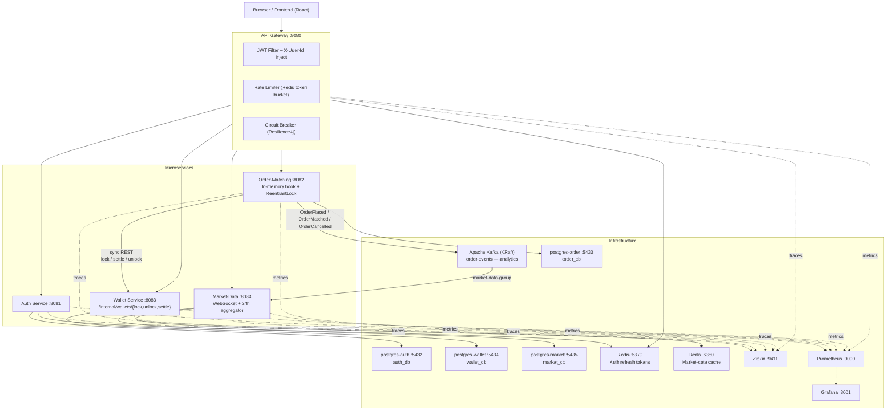

# Crypto Exchange Platform

[](https://github.com/Serhii-Leniv/crypto-platform/actions/workflows/ci.yml)
[](https://openjdk.org/projects/jdk/21/)
[](https://spring.io/projects/spring-boot)
[](https://spring.io/projects/spring-cloud)
[](https://kafka.apache.org/)
[](https://www.postgresql.org/)
[](https://redis.io/)
[](https://docs.docker.com/compose/)
[](LICENSE)

A **microservices crypto trading platform** that behaves like a real exchange — not a bootcamp demo. Orders lock funds synchronously before entering the book, matches settle atomically across both wallets in one transaction, the engine refuses to trade a user against themselves, and `IOC` / `FOK` / `POST_ONLY` actually do what their names imply.

**The interesting parts** — in priority order, what to look at if you only have ten minutes:

- **Synchronous fund locking before book entry** ([ADR-0001](docs/decisions/0001-sync-wallet-rest-for-fund-locking.md)) — fixes a class of correctness bugs in the async-Kafka shape it replaced.
- **Atomic 4-wallet settlement in one transaction** ([ADR-0002](docs/decisions/0002-atomic-settlement-transaction.md)) — buyer-base, buyer-quote, seller-base, seller-quote, fees, slippage refund — all-or-nothing.
- **In-memory order book under per-symbol `ReentrantLock`** ([ADR-0003](docs/decisions/0003-in-memory-order-book.md)) — `TreeMap<BigDecimal, ArrayDeque<Order>>`, replayed from Postgres on startup.
- **Real-exchange order semantics** ([ADR-0006](docs/decisions/0006-real-exchange-order-semantics.md)) — GTC / IOC / FOK / POST_ONLY with compensating unlocks, self-trade prevention, stop-limit via scheduled activation.
- **One Postgres per service** ([ADR-0004](docs/decisions/0004-separate-postgres-per-service.md)) — independent schemas, independent failure domains, no cross-service joins by construction.

**Where to start**, depending on who you are:

| You are… | Start here |
|---|---|
| A recruiter scanning for tech | The badges above + [Quick Start](#quick-start) (one command to a running stack) |
| An engineer wanting to read the code | [docs/ARCHITECTURE.md](docs/ARCHITECTURE.md) — sequence diagrams + the 8 files worth reading first |
| Someone curious about *why* it's built this way | [docs/decisions/](docs/decisions/) — 7 short ADRs |
| Trying it locally right now | `cp .env.example .env && docker compose up --build`; log in as `alice@demo.io` / `Password1` |

---

## Table of Contents

- [Key Features](#key-features) — what the platform actually does
- [Architecture](#architecture) — services, data stores, the diagram
- [Technology Stack](#technology-stack)
- [Quick Start](#quick-start) — clone, `docker compose up`, log in as `alice@demo.io`
- [API Reference](#api-reference)
- [Order Matching](#order-matching)
- [Engineering Depth](#engineering-depth) — ADRs + `docs/ARCHITECTURE.md`
- [Performance](#performance) — measured numbers, not adjectives
- [Observability](#observability)
- [Local Development](#local-development)
- [Environment Variables](#environment-variables)
- [Project Structure](#project-structure)

---

## Key Features

### Trading mechanics

| Feature | Details |
|---|---|
| **Real-Exchange Matching** | Price-time-priority in-memory order book — `LIMIT`, `MARKET`, `STOP_LIMIT`; per-symbol `ReentrantLock` |
| **Time-in-Force** | `GTC` (default), `IOC`, `FOK`, `POST_ONLY` — enforced before / after match with compensating unlocks |
| **Synchronous Fund Lock** | Wallet REST `/internal/wallets/lock` runs **before** the order enters the book — no trading on credit |
| **Atomic 4-Wallet Settlement** | One `@Transactional` `/internal/wallets/settle` moves base + quote between buyer and seller, applies maker / taker fees, and refunds buyer slippage |
| **Self-Trade Prevention** | Matching engine skips counterparties owned by the same user; `FOK` feasibility scan respects STP |
| **Trading-Pair Registry** | DB-backed whitelist with `tick_size` and `min_quantity` validation on every order |
| **Stop Orders** | `STOP_LIMIT` parked as `TRIGGER_PENDING` with funds locked; `StopOrderMonitor` activates on price-cross |
| **WebSocket Market Data** | STOMP over SockJS — `/topic/orderbook/{symbol}`, `/topic/trades/{symbol}`, `/topic/market-data` |
| **Truthful 24 h Stats** | Aggregated from a `trades` table every 30 s, cached in Redis with midnight eviction |

### Platform & security

| Feature | Details |
|---|---|
| **JWT Authentication** | Stateless access token (15 min) + `httpOnly` refresh-token cookie with rotation (7 days) |
| **API Gateway** | Single entry point — JWT filter, `X-User-Id` injection, CORS, rate limiting, circuit breaker |
| **Rate Limiting** | Redis-backed token-bucket on auth endpoints at the gateway |
| **Circuit Breaker** | Resilience4j on every downstream route — fail-fast 503 on partial outage |
| **Admin Role** | `is_admin` column → JWT claim → `requireAdmin` gateway filter on `/api/v1/admin/**` |
| **Virtual Threads** | All four WebMVC services run on Java 21 virtual threads |
| **Demo Seed** | `dev` profile seeds 3 users (`alice`/`bob`/`charlie`, password `Password1`), wallets, trading pairs, open orders |

### Ops & reliability

| Feature | Details |
|---|---|
| **One Postgres per service** | `postgres-auth/order/wallet/market` — independent migrations and failure domains |
| **Flyway Migrations** | Versioned schema + repeatable seed scripts on every service DB |
| **DLQ + Replay** | Kafka business failures retried with exponential backoff, then routed to DLT; failed events visible in the admin panel for manual replay |
| **Distributed Tracing** | Micrometer Tracing + Zipkin — full request trace across every microservice |
| **Prometheus + Grafana** | Pre-provisioned metrics dashboard, one `docker compose up` away |
| **OpenAPI / Swagger UI** | Interactive docs at `/swagger-ui.html` on every service |
| **Fully Dockerized** | One-command startup — infra + all five services + frontend |

---

## Architecture



### Request Flow

1. Every request hits the **API Gateway** (`8080`). Public routes (`/api/v1/auth/**`, `/api/v1/market-data/**`) bypass JWT validation.
2. `JwtAuthenticationFilter` validates `Authorization: Bearer <token>` and injects an `X-User-Id` header downstream.
3. Each route is wrapped in a **Resilience4j circuit breaker** — if a downstream is unhealthy, the gateway short-circuits to a fast `503`.
4. **Order placement is synchronous end-to-end**: `OrderService` pre-generates the order ID, calls `walletClient.lock()` (REST → wallet `/internal/wallets/lock`), then inserts into the in-memory book, then matches under the per-symbol lock. Each match calls `walletClient.settle()` which performs the atomic 4-wallet transfer (buyer-base, buyer-quote, seller-base, seller-quote + fees) in a single wallet-service transaction.
5. Kafka events (`order-events`) are emitted **after** the in-memory state is consistent — they are an informational stream consumed by `market-data` for analytics. The wallet service no longer consumes order events (its listener is a deliberate no-op, kept for consumer-group offset hygiene).
6. Micrometer Tracing injects `traceId`/`spanId` headers across every hop (HTTP and Kafka). Spans are exported to **Zipkin**.

---

## Technology Stack

| Layer | Technology |
|---|---|
| Language | Java 21 (virtual threads enabled) |
| Framework | Spring Boot 3.4.5 |
| API Gateway | Spring Cloud Gateway 2024.0.1 |
| Security | Spring Security + JWT (JJWT 0.12.6) |
| Fault Tolerance | Resilience4j (circuit breaker + time-limiter) |
| Messaging | Apache Kafka — Confluent Platform 7.8 KRaft |
| Persistence | Spring Data JPA + PostgreSQL 15 |
| Schema Migrations | Flyway (all services) |
| Caching | Spring Data Redis 8 |
| Object Mapping | MapStruct 1.6.3 + Lombok 1.18.36 |
| Tracing | Micrometer Tracing + Zipkin (Brave) |
| Metrics | Micrometer + Prometheus + Grafana |
| Containerization | Docker + Docker Compose |
| Build Tool | Maven (multi-module) |
| API Docs | SpringDoc OpenAPI 2.8.6 (Swagger UI) |
| Frontend | React 19 + TypeScript + TailwindCSS + Vite |

---

## Quick Start

### Prerequisites

- Docker and Docker Compose
- Java 21+ (local development only)
- Maven 3.9+ (local development only)

### Run with Docker Compose

```bash
# 1. Clone the repository
git clone https://github.com/Serhii-Leniv/crypto-platform.git
cd crypto-platform

# 2. Configure environment
cp .env.example .env
# Set JWT_SECRET_KEY to a random string of at least 32 characters

# 3. Build and start all services
docker compose up --build
```

All microservices start after the infrastructure (4× Postgres, 2× Redis, Kafka) reports healthy. The demo seed (`SPRING_PROFILES_ACTIVE=dev`) runs automatically via Flyway repeatable migrations on first boot.

**Demo credentials** (all passwords are `Password1`):

| Email | Role |
|---|---|
| `alice@demo.io` | Admin (sees the admin panel + failed-events DLQ) |
| `bob@demo.io` | Trader |
| `charlie@demo.io` | Trader |

### Verify the Stack

```bash
# Public endpoint — no token required
curl http://localhost:8080/api/v1/market-data

# Register a user
curl -X POST http://localhost:8080/api/v1/auth/register \
  -H "Content-Type: application/json" \
  -d '{"email":"user@example.com","password":"secret123"}'

# Place an order (replace <token> with accessToken from register/login)
curl -X POST http://localhost:8080/api/v1/orders \
  -H "Authorization: Bearer <token>" \
  -H "Content-Type: application/json" \
  -d '{"symbol":"BTC-USDT","side":"BUY","orderType":"LIMIT","quantity":0.1,"price":45000}'
```

### Management UIs

| Tool | URL | Credentials |
|---|---|---|
| Frontend | http://localhost:3000 | — |
| pgAdmin 4 | http://localhost:5050 | admin@crypto.com / admin |
| Zipkin | http://localhost:9411 | — |
| Prometheus | http://localhost:9090 | — |
| Grafana | http://localhost:3001 | admin / admin |
| Swagger UI (Auth) | http://localhost:8081/swagger-ui.html | — |
| Swagger UI (Orders) | http://localhost:8082/swagger-ui.html | — |
| Swagger UI (Wallet) | http://localhost:8083/swagger-ui.html | — |
| Swagger UI (Market) | http://localhost:8084/swagger-ui.html | — |

---

## API Reference

All requests are routed through the **API Gateway** on port `8080`. Protected routes require `Authorization: Bearer <accessToken>`.

### Authentication — `POST /api/v1/auth`

| Method | Path | Auth | Description |
|---|---|---|---|
| POST | `/register` | No | Register a new user account |
| POST | `/login` | No | Authenticate and receive tokens |
| POST | `/refresh` | No | Obtain a new access token |
| POST | `/logout` | Yes | Revoke the current refresh token |

**Request body** (`/register`, `/login`):
```json
{ "email": "user@example.com", "password": "secret123" }
```

**Response**:
```json
{ "accessToken": "eyJ..." }
```

The **refresh token** is set as an `httpOnly`, `Secure`-on-prod cookie (`refresh_token`, `Path=/api/v1/auth`). The frontend never reads it from JS — `POST /api/v1/auth/refresh` restores the session from the cookie.

---

### Orders — `/api/v1/orders`

| Method | Path | Auth | Description |
|---|---|---|---|
| POST | `/` | Yes | Place a new order |
| GET | `/` | Yes | List all orders for the current user |
| GET | `/{orderId}` | Yes | Retrieve a specific order |
| DELETE | `/{orderId}` | Yes | Cancel an open order |
| GET | `/book/{symbol}` | Yes | Retrieve the live order book |

**Place order request body**:
```json
{
  "symbol":        "BTC-USDT",
  "side":          "BUY",
  "orderType":     "LIMIT",
  "quantity":      0.1,
  "price":         45000.00,
  "timeInForce":   "GTC",
  "triggerPrice":  null
}
```

- `side`: `BUY` | `SELL`
- `orderType`: `LIMIT` | `MARKET` | `STOP_LIMIT`
- `timeInForce` (LIMIT only): `GTC` (default) | `IOC` | `FOK` | `POST_ONLY`
- `triggerPrice`: required for `STOP_LIMIT`, otherwise null
- `symbol`: `BASE-QUOTE` or `BASE/QUOTE` (must exist in the `trading_pairs` registry; price must be a multiple of `tick_size`)
- `MARKET BUY` is rejected (no price ceiling to lock against); `MARKET SELL` is supported

**Error responses**:

| Status | Cause |
|---|---|
| `400 InvalidSymbol` | Symbol not listed, below `min_quantity`, or not a `tick_size` multiple |
| `409 Insufficient` | Wallet refused the synchronous lock |
| `409 PostOnlyRejected` | `POST_ONLY` order would cross the book |
| `409 FokRejected` | `FOK` order cannot be fully filled at placement |

---

### Wallets — `/api/v1/wallets`

| Method | Path | Auth | Description |
|---|---|---|---|
| POST | `/deposit` | Yes | Deposit funds into a wallet |
| POST | `/withdraw` | Yes | Withdraw funds from a wallet |
| GET | `/` | Yes | List all wallets for the current user |
| GET | `/transactions` | Yes | List all transactions |

**Deposit / Withdraw body**: `{ "currency": "USDT", "amount": 1000.00 }`

---

### Market Data — `/api/v1/market-data`

| Method | Path | Auth | Description |
|---|---|---|---|
| GET | `/` | No | List 24 h stats for all symbols |
| GET | `/{symbol}` | No | Get 24 h stats for a specific symbol |

**Response**:
```json
{
  "symbol": "BTC-USDT",
  "lastPrice": 45123.50,
  "openPrice24h": 44800.00,
  "high24h": 45500.00,
  "low24h": 44200.00,
  "volume24h": 123.456,
  "tradeCount24h": 87
}
```

WebSocket (STOMP over SockJS, served by `market-data` and `order-matching`):

| Topic | Source |
|---|---|
| `/topic/market-data` | Broadcast on every 24 h aggregator tick |
| `/topic/orderbook/{symbol}` | Broadcast on every book mutation |
| `/topic/trades/{symbol}` | Broadcast on every match |

### Admin — `/api/v1/admin`

Available to authenticated users; in `dev` profile the demo `alice` account is treated as admin.

| Method | Path | Description |
|---|---|---|
| GET  | `/failed-events` | Dead-letter queue: Kafka events that exceeded retries |
| POST | `/failed-events/{id}/replay` | Manually replay a single failed event |

---

## Order Matching

Price-time priority over an in-memory book. The path is fully synchronous so the API caller knows whether the order was accepted, rejected, locked, matched, and settled by the time the HTTP response returns.

The headline shape: **validate → lock funds (sync REST) → persist → TIF pre-checks → enter book → match → settle (atomic) → respond**. Stop-limits skip the book and park as `TRIGGER_PENDING` until a `@Scheduled` monitor sees the trigger price cross.

For the step-by-step walkthrough with Mermaid sequence diagrams (place / match / cancel / stop activation), see **[docs/ARCHITECTURE.md](docs/ARCHITECTURE.md)**.

---

## Engineering Depth

Each significant design choice is documented as a short **Architecture Decision Record** — context, decision, consequences, and the alternatives that were rejected:

| # | Decision | What it pins down |
|---|---|---|
| [0001](docs/decisions/0001-sync-wallet-rest-for-fund-locking.md) | Synchronous wallet REST for fund locking | Why the old async-Kafka shape was a correctness bug, not a design choice |
| [0002](docs/decisions/0002-atomic-settlement-transaction.md) | Atomic 4-wallet settlement in one transaction | How partial-settlement inconsistency is made impossible |
| [0003](docs/decisions/0003-in-memory-order-book.md) | In-memory order book with per-symbol `ReentrantLock` | Why match latency is in-heap, not in-database |
| [0004](docs/decisions/0004-separate-postgres-per-service.md) | Separate Postgres per service | True service ownership of schema + independent failure domains |
| [0005](docs/decisions/0005-persistable-uuid-for-orders.md) | `Persistable<UUID>` for pre-generated order IDs | The JPA reason behind a 5-line entity quirk |
| [0006](docs/decisions/0006-real-exchange-order-semantics.md) | TIF, STP, stop-limit | What each compensation path actually does |
| [0007](docs/decisions/0007-solo-workflow-direct-push.md) | Solo workflow — direct push for trivia | Why this repo dropped its PR-Agent pipeline |
| [0008](docs/decisions/0008-fees-credited-to-house-wallet.md) | Maker / taker fees credited to a house wallet | Fees no longer evaporate; conservation invariant restored |
| [0009](docs/decisions/0009-transactional-outbox-for-kafka.md) | Transactional outbox for Kafka events | How dual-write to DB + Kafka is made atomic at-least-once |

For the wider how-it-works narrative (sequence diagrams, state-distribution table, failure modes, settlement breakdown), see **[docs/ARCHITECTURE.md](docs/ARCHITECTURE.md)**.

---

## Performance

Measured numbers from `load/place-orders.js` (k6) hitting the matching engine end-to-end —
`validate → walletClient.lock → persist → enter book → match → walletClient.settle` — on a
single-instance Docker Compose deployment (local dev box, Java 21, virtual threads on).

Two demo users alternate BUY/SELL on `BTC-USDT` so settled trades keep both wallets liquid;
the gateway's per-user rate limiter (10 req/s) is bypassed by hitting `order-matching:8082`
directly so we measure the engine, not the limiter.

| VUs | Duration | Throughput (ok) | p50 | p95 | Mean settle | Notes |
|---:|---:|---:|---:|---:|---:|---|
|  5 | 30s | **67 orders/s** |  57 ms | 104 ms | 7.7 ms | Contention-free baseline. Wallet pessimistic locks rarely queue. |
| 10 | 30s | 61 orders/s | 106 ms | 188 ms | 7.7 ms | Wallet-row contention starts to show as tail-latency. |
| 50 | 30s | 73 orders/s | 452 ms | 666 ms | 7.7 ms | Saturated. Wallet `SELECT FOR UPDATE` is the bottleneck. |

**Settle latency** (Micrometer Timer in `wallet-service`): mean **7.7 ms**, max **89 ms** —
the full atomic 4-wallet movement + fees + slippage refund inside one transaction.

**Why the throughput ceiling is here:** each match round-trips to `wallet-service` over HTTP
and serialises through `PESSIMISTIC_WRITE` row locks on the buyer's and seller's wallets.
That's a deliberate correctness choice ([ADR-0002](docs/decisions/0002-atomic-settlement-transaction.md))
and the documented next step is sharding by user / symbol — the engine itself is sub-millisecond
under its per-symbol `ReentrantLock`.

Run it yourself: see [`load/README.md`](load/README.md).

---

## Observability

### Distributed Tracing (Zipkin)

Every HTTP request and Kafka message is instrumented with Micrometer Tracing. Brave propagates `traceId`/`spanId` headers through the gateway, into downstream services, and across Kafka producers and consumers. Traces are exported to **Zipkin** at `http://localhost:9411`.

Open the Zipkin UI and search by `traceId` to see the full call chain: Gateway → Order-Matching → Kafka → Wallet + Market-Data.

### Metrics (Prometheus + Grafana)

All services expose `/actuator/prometheus`. Prometheus scrapes every 15 s. A pre-provisioned **Grafana** dashboard (available at `http://localhost:3001`) shows:

- JVM memory and GC metrics per service
- HTTP request rates, error rates, and latency percentiles
- Kafka consumer lag
- Active circuit breaker state (CLOSED / OPEN / HALF-OPEN)

### Structured Logging

Each service logs the `traceId` and `spanId` automatically via Micrometer Tracing's Logback integration, making it easy to correlate a single request across log lines in any log aggregator (ELK, Loki, etc.).

---

## Local Development

```bash
# Build all modules (skip tests)
mvn -B clean package -DskipTests

# Run all tests
mvn -B clean verify

# Run tests for a single module
mvn -B test -pl order-matching

# Run a single test class
mvn -B test -pl order-matching -Dtest=OrderMatchingEngineTest

# Start only infrastructure (run services from IDE)
docker compose up postgres redis-cache redis-market kafka zipkin
```

---

## Environment Variables

Copy `.env.example` to `.env` before starting. The only variable that **must** be changed for production:

| Variable | Description | Requirement |
|---|---|---|
| `JWT_SECRET_KEY` | HS256 signing secret shared by all services | Minimum 32 characters |
| `POSTGRES_PASSWORD` | PostgreSQL superuser password | Any secure string |
| `CORS_ALLOWED_ORIGINS` | Frontend origin(s) allowed by the gateway | e.g. `https://yourdomain.com` |

---

## Project Structure

```
crypto-platform/
├── auth/                   # Registration, login, JWT issuance, refresh-token cookie rotation
├── gateway/                # Spring Cloud Gateway — routing, JWT filter, circuit breaker, CORS
├── order-matching/         # In-memory book, matching engine, sync WalletClient, StopOrderMonitor
├── wallet/                 # Balances, /internal/wallets/{lock,unlock,settle}, DLQ + replay
├── market-data/            # 24 h aggregator, WebSocket broadcast, Redis cache, Kafka consumer
├── frontend/               # React 19 + TS + TailwindCSS — "Kairos Capital" trading UI + admin panel
├── docker/                 # PostgreSQL init, Prometheus config, Grafana provisioning
├── docker-compose.yml      # Full stack — 4× postgres, 2× redis, Kafka, Zipkin, Prom/Grafana, all 5 services + frontend
└── pom.xml                 # Parent Maven POM (Java 21, Spring Boot 3.4.5)
```

---

## License

[MIT](LICENSE)
