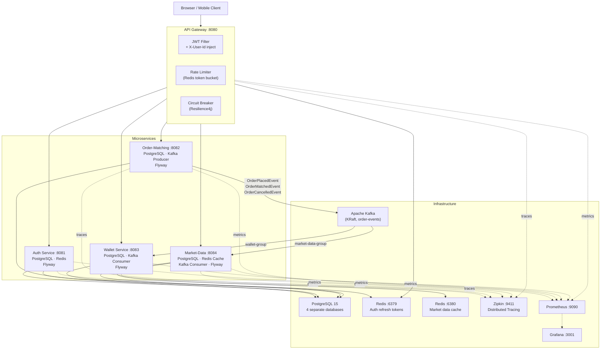

# Crypto Exchange Platform

[](https://github.com/Serhii-Leniv/crypto-platform/actions/workflows/ci.yml)
[](https://openjdk.org/projects/jdk/21/)
[](https://spring.io/projects/spring-boot)
[](https://spring.io/projects/spring-cloud)
[](https://kafka.apache.org/)
[](https://www.postgresql.org/)
[](https://redis.io/)
[](https://docs.docker.com/compose/)
[](k8s/)
[](LICENSE)

A **production-grade cryptocurrency exchange platform** built on a microservices architecture. The system handles user authentication, order placement and matching, wallet management, and real-time market data — all communicating asynchronously through Apache Kafka.

---

## Table of Contents

- [Key Features](#key-features)
- [Architecture](#architecture)
- [Technology Stack](#technology-stack)
- [Quick Start](#quick-start)
- [API Reference](#api-reference)
- [Order Matching](#order-matching)
- [Design Decisions](#design-decisions)
- [Observability](#observability)
- [Kubernetes](#kubernetes)
- [Local Development](#local-development)
- [Environment Variables](#environment-variables)
- [Project Structure](#project-structure)

---

## Key Features

| Feature | Details |
|---|---|
| **JWT Authentication** | Stateless access tokens (15 min) + Redis-backed refresh token rotation (7 days) |
| **Price-Time Priority Engine** | In-memory order book — LIMIT and MARKET orders, BUY/SELL sides |
| **Saga Pattern** | Distributed atomic fund locking/unlocking via Kafka events |
| **Event-Driven Architecture** | `ORDER_PLACED → ORDER_MATCHED → ORDER_CANCELLED` fan-out over Kafka |
| **Circuit Breaker** | Resilience4j circuit breakers on all gateway routes — fail-fast with graceful fallbacks |
| **Distributed Tracing** | Micrometer Tracing + Zipkin — full request trace across every microservice |
| **Market Data Cache** | 24 h rolling stats (last, high, low, volume, trades) in Redis with midnight eviction |
| **Rate Limiting** | Redis-backed token-bucket rate limiter on auth endpoints at the gateway |
| **API Gateway** | Single entry point — JWT filter, `X-User-Id` injection, CORS, rate limiting |
| **Virtual Threads** | All four WebMVC services run on Java 21 virtual threads |
| **Flyway Migrations** | Schema versioning on every service database — no manual DDL |
| **OpenAPI / Swagger UI** | Interactive docs at `/swagger-ui.html` on every service |
| **Prometheus + Grafana** | Pre-provisioned metrics dashboard, one `docker compose up` away |
| **Fully Dockerized** | One-command startup — infra and all five services |
| **Kubernetes Ready** | Deployment manifests, Services, and Ingress in `k8s/` |

---

## Architecture



### Request Flow

1. Every request hits the **API Gateway** (`8080`).
2. `JwtAuthenticationFilter` validates the `Authorization: Bearer <token>` header for protected routes and injects the `X-User-Id` header downstream.
3. Public routes (`/api/v1/auth/**`, `/api/v1/market-data/**`) bypass JWT validation.
4. Each route is wrapped by a **Resilience4j circuit breaker** — if a service is down, the gateway returns a graceful `503` within milliseconds instead of hanging threads.
5. Micrometer Tracing injects trace/span IDs into every request. All spans are collected by **Zipkin** for end-to-end latency analysis.

---

## Technology Stack

| Layer | Technology |
|---|---|
| Language | Java 21 (virtual threads enabled) |
| Framework | Spring Boot 3.4.5 |
| API Gateway | Spring Cloud Gateway 2024.0.1 |
| Security | Spring Security + JWT (JJWT 0.12.6) |
| Fault Tolerance | Resilience4j (circuit breaker + time-limiter) |
| Messaging | Apache Kafka — Confluent Platform 7.8 KRaft |
| Persistence | Spring Data JPA + PostgreSQL 15 |
| Schema Migrations | Flyway (all services) |
| Caching | Spring Data Redis 8 |
| Object Mapping | MapStruct 1.6.3 + Lombok 1.18.36 |
| Tracing | Micrometer Tracing + Zipkin (Brave) |
| Metrics | Micrometer + Prometheus + Grafana |
| Containerization | Docker + Docker Compose |
| Orchestration | Kubernetes (manifests in `k8s/`) |
| Build Tool | Maven (multi-module) |
| API Docs | SpringDoc OpenAPI 2.8.6 (Swagger UI) |
| Frontend | React 19 + TypeScript + TailwindCSS + Vite |

---

## Quick Start

### Prerequisites

- Docker and Docker Compose
- Java 21+ (local development only)
- Maven 3.9+ (local development only)

### Run with Docker Compose

```bash
# 1. Clone the repository
git clone https://github.com/Serhii-Leniv/crypto-platform.git
cd crypto-platform

# 2. Configure environment
cp .env.example .env
# Set JWT_SECRET_KEY to a random string of at least 32 characters

# 3. Build and start all services
docker compose up --build
```

All microservices start after the infrastructure (Postgres, Kafka, Redis) reports healthy.

### Verify the Stack

```bash
# Public endpoint — no token required
curl http://localhost:8080/api/v1/market-data

# Register a user
curl -X POST http://localhost:8080/api/v1/auth/register \
  -H "Content-Type: application/json" \
  -d '{"email":"user@example.com","password":"secret123"}'

# Place an order (replace <token> with accessToken from register/login)
curl -X POST http://localhost:8080/api/v1/orders \
  -H "Authorization: Bearer <token>" \
  -H "Content-Type: application/json" \
  -d '{"symbol":"BTC-USDT","side":"BUY","orderType":"LIMIT","quantity":0.1,"price":45000}'
```

### Management UIs

| Tool | URL | Credentials |
|---|---|---|
| Frontend | http://localhost:3000 | — |
| pgAdmin 4 | http://localhost:5050 | admin@crypto.com / admin |
| Zipkin | http://localhost:9411 | — |
| Prometheus | http://localhost:9090 | — |
| Grafana | http://localhost:3001 | admin / admin |
| Swagger UI (Auth) | http://localhost:8081/swagger-ui.html | — |
| Swagger UI (Orders) | http://localhost:8082/swagger-ui.html | — |
| Swagger UI (Wallet) | http://localhost:8083/swagger-ui.html | — |
| Swagger UI (Market) | http://localhost:8084/swagger-ui.html | — |

---

## API Reference

All requests are routed through the **API Gateway** on port `8080`. Protected routes require `Authorization: Bearer <accessToken>`.

### Authentication — `POST /api/v1/auth`

| Method | Path | Auth | Description |
|---|---|---|---|
| POST | `/register` | No | Register a new user account |
| POST | `/login` | No | Authenticate and receive tokens |
| POST | `/refresh` | No | Obtain a new access token |
| POST | `/logout` | Yes | Revoke the current refresh token |

**Request body** (`/register`, `/login`):
```json
{ "email": "user@example.com", "password": "secret123" }
```

**Response**:
```json
{ "accessToken": "eyJ...", "refreshToken": "eyJ..." }
```

---

### Orders — `/api/v1/orders`

| Method | Path | Auth | Description |
|---|---|---|---|
| POST | `/` | Yes | Place a new order |
| GET | `/` | Yes | List all orders for the current user |
| GET | `/{orderId}` | Yes | Retrieve a specific order |
| DELETE | `/{orderId}` | Yes | Cancel an open order |
| GET | `/book/{symbol}` | Yes | Retrieve the live order book |

**Place order request body**:
```json
{
  "symbol": "BTC-USDT",
  "side": "BUY",
  "orderType": "LIMIT",
  "quantity": 0.1,
  "price": 45000.00
}
```

`side`: `BUY` | `SELL` &nbsp;·&nbsp; `orderType`: `LIMIT` | `MARKET` &nbsp;·&nbsp; Symbol: `BASE-QUOTE` or `BASE/QUOTE`

---

### Wallets — `/api/v1/wallets`

| Method | Path | Auth | Description |
|---|---|---|---|
| POST | `/deposit` | Yes | Deposit funds into a wallet |
| POST | `/withdraw` | Yes | Withdraw funds from a wallet |
| GET | `/` | Yes | List all wallets for the current user |
| GET | `/transactions` | Yes | List all transactions |

**Deposit / Withdraw body**: `{ "currency": "USDT", "amount": 1000.00 }`

---

### Market Data — `/api/v1/market-data`

| Method | Path | Auth | Description |
|---|---|---|---|
| GET | `/` | No | List 24 h stats for all symbols |
| GET | `/{symbol}` | No | Get 24 h stats for a specific symbol |

**Response**:
```json
{
  "symbol": "BTC-USDT",
  "lastPrice": 45123.50,
  "openPrice24h": 44800.00,
  "high24h": 45500.00,
  "low24h": 44200.00,
  "volume24h": 123.456,
  "tradeCount24h": 87
}
```

---

## Order Matching

The engine uses **price-time priority**:

1. A `LIMIT BUY` order for `BTC-USDT` at `45,000` is persisted to PostgreSQL.
2. An `OrderPlacedEvent` is published to the `order-events` Kafka topic. The wallet service immediately **locks** the required USDT balance.
3. The matching engine scans open `SELL` orders sorted by price ascending, then by `created_at` (time priority).
4. The first SELL order with `price ≤ 45,000` is matched at the resting (SELL) price.
5. An `OrderMatchedEvent` is published. The wallet service **atomically transfers** funds between buyer and seller.
6. The market-data service updates 24 h stats and evicts the Redis cache entry.

Partial fills are supported — an order moves to `PARTIALLY_FILLED` and remains in the book until fully consumed or cancelled.

Idempotency is enforced via a `processed_events` table in the wallet service — duplicate Kafka events keyed by `orderId`/`tradeId` are discarded.

---

## Design Decisions

### Why Kafka over REST calls between services?

Synchronous REST between services creates tight coupling and cascading failures — if the wallet service is slow, order placement blocks too. Kafka decouples producers from consumers, giving independent scalability, natural backpressure, and a durable audit trail of every event.

### Why a Saga over a distributed transaction?

XA/2PC distributed transactions require all participants to be available and add coordinator overhead. The Saga pattern breaks the transaction into local steps (`LOCK → TRANSFER → UNLOCK`) each published as an event. Compensating events (`OrderCancelledEvent → UNLOCK`) handle failures without a central coordinator.

### Why Circuit Breakers at the gateway?

Wrapping every downstream route in a Resilience4j circuit breaker means a failing service causes fast failures at the gateway edge — open circuits return `503` in microseconds rather than holding open HTTP connections for 30 s. This prevents thread-pool exhaustion under partial failure.

### Why two Redis instances?

Auth refresh tokens and market data have completely different eviction strategies: auth tokens are evicted by TTL on logout, while market data is evicted at midnight or on trade. Separate instances isolate configuration and prevent a market-data cache flush from affecting auth token lookups.

### Why Flyway over `ddl-auto=create`?

`ddl-auto=update` is fine for prototyping but silently drops columns on rename and cannot be applied to production without risk. Flyway provides versioned, repeatable, reviewable SQL migrations with a full history in the `flyway_schema_history` table.

---

## Observability

### Distributed Tracing (Zipkin)

Every HTTP request and Kafka message is instrumented with Micrometer Tracing. Brave propagates `traceId`/`spanId` headers through the gateway, into downstream services, and across Kafka producers and consumers. Traces are exported to **Zipkin** at `http://localhost:9411`.

Open the Zipkin UI and search by `traceId` to see the full call chain: Gateway → Order-Matching → Kafka → Wallet + Market-Data.

### Metrics (Prometheus + Grafana)

All services expose `/actuator/prometheus`. Prometheus scrapes every 15 s. A pre-provisioned **Grafana** dashboard (available at `http://localhost:3001`) shows:

- JVM memory and GC metrics per service
- HTTP request rates, error rates, and latency percentiles
- Kafka consumer lag
- Active circuit breaker state (CLOSED / OPEN / HALF-OPEN)

### Structured Logging

Each service logs the `traceId` and `spanId` automatically via Micrometer Tracing's Logback integration, making it easy to correlate a single request across log lines in any log aggregator (ELK, Loki, etc.).

---

## Kubernetes

Production-ready Kubernetes manifests live in `k8s/`:

```
k8s/
├── namespace.yaml
├── configmap.yaml
├── secrets.yaml
├── postgres/
│   ├── deployment.yaml
│   └── service.yaml
├── redis/
│   ├── deployment.yaml
│   └── service.yaml
├── kafka/
│   ├── deployment.yaml
│   └── service.yaml
├── auth/
│   ├── deployment.yaml
│   └── service.yaml
├── order-matching/
│   ├── deployment.yaml
│   └── service.yaml
├── wallet/
│   ├── deployment.yaml
│   └── service.yaml
├── market-data/
│   ├── deployment.yaml
│   └── service.yaml
├── gateway/
│   ├── deployment.yaml
│   └── service.yaml
└── ingress.yaml
```

Deploy to a cluster:

```bash
kubectl apply -f k8s/namespace.yaml
kubectl apply -f k8s/configmap.yaml
# Create secrets (edit k8s/secrets.yaml first)
kubectl apply -f k8s/secrets.yaml
kubectl apply -f k8s/
```

Each service deployment includes **liveness** and **readiness** probes wired to `/actuator/health`, so Kubernetes only routes traffic to healthy instances and automatically restarts crashed pods.

---

## Local Development

```bash
# Build all modules (skip tests)
mvn -B clean package -DskipTests

# Run all tests
mvn -B clean verify

# Run tests for a single module
mvn -B test -pl order-matching

# Run a single test class
mvn -B test -pl order-matching -Dtest=OrderMatchingEngineTest

# Start only infrastructure (run services from IDE)
docker compose up postgres redis-cache redis-market kafka zipkin
```

---

## Environment Variables

Copy `.env.example` to `.env` before starting. The only variable that **must** be changed for production:

| Variable | Description | Requirement |
|---|---|---|
| `JWT_SECRET_KEY` | HS256 signing secret shared by all services | Minimum 32 characters |
| `POSTGRES_PASSWORD` | PostgreSQL superuser password | Any secure string |
| `CORS_ALLOWED_ORIGINS` | Frontend origin(s) allowed by the gateway | e.g. `https://yourdomain.com` |

---

## Project Structure

```
crypto-platform/
├── auth/                   # Registration, login, JWT issuance, refresh token rotation
├── gateway/                # Spring Cloud Gateway — routing, JWT filter, circuit breaker, CORS
├── order-matching/         # Order book, price-time-priority matching engine, Kafka producer
├── wallet/                 # Wallet balances, fund locking/unlocking, Kafka consumer (Saga)
├── market-data/            # 24 h trade stats, Redis cache, Kafka consumer
├── frontend/               # React 19 + TypeScript + TailwindCSS
├── k8s/                    # Kubernetes deployment manifests
├── docker/                 # PostgreSQL init scripts, Prometheus config, Grafana provisioning
├── docker-compose.yml      # Full stack — infra + all five services + Zipkin + Grafana
└── pom.xml                 # Parent Maven POM (Java 21, Spring Boot 3.4.5)
```

---

## License

[MIT](LICENSE)
