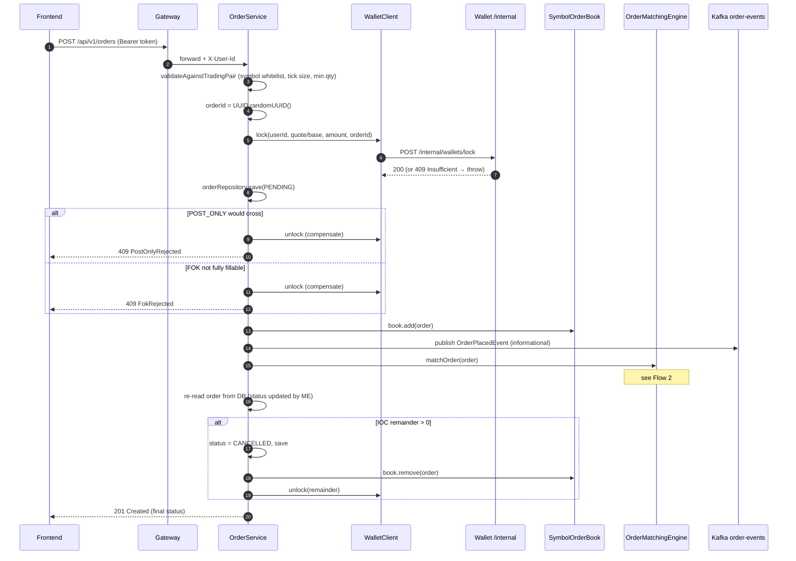
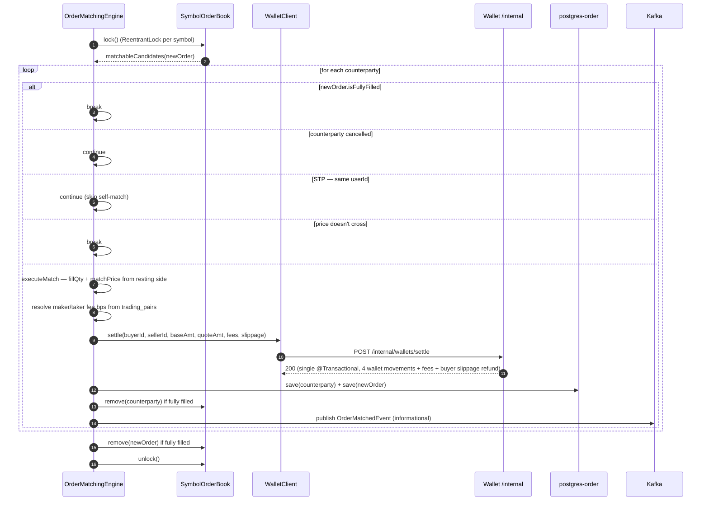
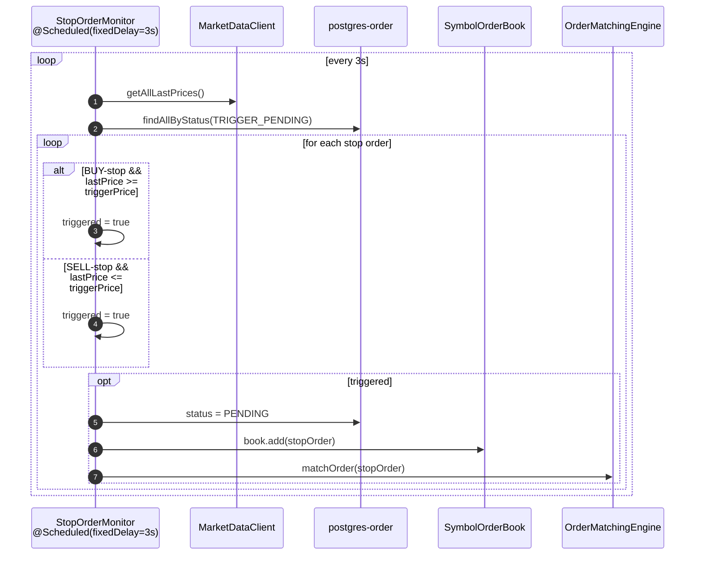

# Architecture — How It Works

This document goes one level deeper than the [README](../README.md) and walks through the actual code paths that turn an HTTP request into a settled trade. Every claim here points at a real file. For the *why* behind these designs, see [decisions/](decisions/).

---

## Service Topology

```
                           ┌─────────────┐
                           │ Frontend    │  React 19 · :3000
                           │ Kairos UI   │
                           └─────┬───────┘
                                 │ JWT (access) + httpOnly cookie (refresh)
                                 ▼
                         ┌───────────────┐
                         │ API Gateway   │  :8080  · JWT filter, X-User-Id, CB, rate limit
                         └───┬───┬───┬───┘
                ┌────────────┘   │   └────────────────┐
                ▼                ▼                    ▼
        ┌─────────────┐   ┌─────────────┐      ┌─────────────┐
        │ Auth :8081  │   │ Order :8082 │ ───► │ Wallet:8083 │  sync REST: /internal/wallets/*
        └─────┬───────┘   └─────┬───────┘      └─────┬───────┘
              │                 │ Kafka              │
              │                 ▼ informational      │
              │            ┌─────────┐               │
              │            │ Kafka   │ ────────────► Market :8084 ──► WS broadcast
              │            └─────────┘
              ▼
        postgres-auth · redis-auth        postgres-order · postgres-wallet · postgres-market · redis-market
```

State distribution at a glance:

| Where | What lives there |
|---|---|
| `postgres-auth` | `users`, `refresh_tokens` |
| `postgres-order` | `orders`, `trading_pairs` |
| `postgres-wallet` | `wallets`, `transactions`, `processed_events`, `failed_events` |
| `postgres-market` | `market_data`, `trades` |
| `redis-auth` | refresh-token revocation set |
| `redis-market` | 24 h aggregates cache |
| Order-matching JVM heap | `OrderBookManager` → `SymbolOrderBook` per symbol (`TreeMap<BigDecimal, ArrayDeque<Order>>`) |

The in-memory book is rebuilt from `postgres-order` on every startup by `OrderBookInitializer` (`ApplicationRunner`). PostgreSQL is the durable source of truth; the JVM heap is the fast path.

---

## Flow 1 — Place a LIMIT order



Key invariants:

- The order **does not exist** until the wallet lock succeeds. A 4xx from `/internal/wallets/lock` aborts placement before any persistence.
- `Order` implements `Persistable<UUID>` so Spring Data's `save()` takes the `INSERT` path despite the pre-set `@Id`. See [ADR-0005](decisions/0005-persistable-uuid-for-orders.md).
- TIF rejections (POST_ONLY, FOK) fire compensating unlocks before throwing. This is best-effort — see `OrderService.compensateLockOnReject()`.

---

## Flow 2 — Match an order



Why this shape:

- Settlement is the **synchronous** moment when correctness is guaranteed (see [ADR-0001](decisions/0001-sync-wallet-rest-for-fund-locking.md), [ADR-0002](decisions/0002-atomic-settlement-transaction.md)).
- The per-symbol `ReentrantLock` serialises mutations on one symbol while leaving other symbols' books fully parallel. See [ADR-0003](decisions/0003-in-memory-order-book.md).
- Kafka events are emitted **after** the in-memory state and wallet state are consistent — they are an analytics stream, not a correctness dependency.

---

## Flow 3 — Cancel

`OrderService.cancelOrder()` is straightforward:

1. Load the order scoped by `(orderId, userId)`. Wrong user → `OrderNotFoundException` (looks like 404, leaks nothing).
2. Reject `FILLED` (`IllegalStateException`) and `CANCELLED` (no-op).
3. Flip status to `CANCELLED`, persist.
4. Remove from book if it was in the book (`PENDING` / `PARTIALLY_FILLED`); skip for `TRIGGER_PENDING` (stops never enter the book).
5. Compute the remainder; call `walletClient.unlock(...)` in one shot.
6. Emit `OrderCancelledEvent` to Kafka (informational).

Wallet unlock failures here are logged but do not block cancellation — the order is already off the book and a manual reconciliation against `processed_events` would catch the divergence.

---

## Flow 4 — Stop-limit activation



Funds were already locked at placement, so activation is purely a state transition. See [ADR-0006](decisions/0006-real-exchange-order-semantics.md).

---

## Atomic Settlement Breakdown

`wallet-service` exposes `POST /internal/wallets/settle` which executes inside a single `@Transactional`. For one match it performs the following on `wallets` and `transactions`:

| Step | Account | Currency | Operation | Note |
|---|---|---|---|---|
| 1 | buyer | base | `available += baseAmount − buyerFee` | maker or taker fee per the buyer's role |
| 2 | buyer | quote | `locked   −= quoteAmount` | release the part of the lock that's being spent |
| 3 | seller | base | `locked   −= baseAmount` | release the part of the lock that's being delivered |
| 4 | seller | quote | `available += quoteAmount − sellerFee` | maker or taker fee per the seller's role |
| 5 | **house** | base | `available += buyerFee` | fee revenue from buyer ([ADR-0008](decisions/0008-fees-credited-to-house-wallet.md)) |
| 6 | **house** | quote | `available += sellerFee` | fee revenue from seller |
| 7 | buyer | quote | `available += (buyerLimitPrice − execPrice) × qty` | slippage refund (only when matched below the limit) |

All movements share one transaction. A failure at any step rolls back all of them and the matching engine's outer transaction rolls back the in-memory fill it just applied (re-thrown exception). Conservation invariant: per trade `Σ deposits = Σ debits` (fees are no longer lost — they go to the house user `00000000-0000-0000-0000-00000000feee`).

Idempotency: `processed_events` has a composite unique index on `(event_id, event_type)` so the same `tradeId` for `ORDER_MATCHED` is safe to retry but does not block a later `ORDER_CANCELLED` for the same `orderId`.

---

## Identity & Auth Path

1. `POST /api/v1/auth/register` or `/login` returns `{ accessToken }` and sets a `Set-Cookie: refresh_token=...; HttpOnly; Path=/api/v1/auth`.
2. Access token: HS256, `exp=15min`, claims `{ sub: email, userId: UUID, isAdmin: bool }`.
3. Gateway's `JwtAuthenticationFilter`:
   - Reads `Authorization: Bearer <token>`, validates signature + expiry against `application.security.jwt.secret-key` (same env var across all services).
   - Extracts `userId` claim and injects `X-User-Id` header into the downstream request.
   - For admin routes (`/api/v1/admin/**`), `requireAdmin` filter checks the `isAdmin` claim.
4. Downstream services trust the `X-User-Id` header — they do **not** re-validate the JWT (except wallet-service, which holds the secret for its own scheduled tasks).
5. `POST /api/v1/auth/refresh` reads the cookie, validates the refresh token against the Redis revocation set, and issues a new access token. Refresh-token rotation reissues a new cookie on every refresh.

---

## What lives in memory vs. in the DB

| State | Memory | DB | Why |
|---|---|---|---|
| Order book entries | `SymbolOrderBook` | `orders` table | Memory is the fast path for matching; DB is durable + replayed at startup. |
| Order status / fill qty | mirrored in memory `Order` ref | `orders` table | Each match calls `orderRepository.save()` so DB is always at least eventually correct after the lock is released. |
| Trading pairs / fees | not cached | `trading_pairs` | Lookup is per-match, cached implicitly by JPA L1 inside the transaction. |
| Wallet balances | not cached | `wallets` (`PESSIMISTIC_WRITE` per row) | Single source of truth; pessimistic lock prevents double-spend under concurrency. |
| 24h aggregates | `redis-market` | `trades` | DB is truth; Redis is the 30-second-stale view consumed by the frontend. |
| Refresh-token revocation | `redis-auth` set | — | Pure cache; absence = valid, presence = revoked. |

---

## Failure modes & where they land

| Failure | Where it surfaces | Resolution |
|---|---|---|
| Wallet `/internal/wallets/lock` returns 4xx | `WalletClient` throws `InsufficientFundsException` → 409 to caller | User retries with smaller order |
| Wallet `/internal/wallets/settle` fails mid-match | `RuntimeException` propagates → `OrderMatchingEngine`'s `@Transactional` rolls back the in-memory fill | Caller sees 500; order remains in book in its prior state |
| Wallet `/internal/wallets/unlock` fails on cancel | Logged; order is already off the book | Manual reconciliation via admin panel `failed_events` |
| Kafka consumer business exception | `DefaultErrorHandler` retries with exponential backoff, then routes to `<topic>.DLT` | Admin panel `/api/v1/admin/failed-events` for manual replay |
| `OrderBookInitializer` finds an order that was filled while the JVM was down | On startup, the order has its DB status; init re-inserts it if it's `PENDING` / `PARTIALLY_FILLED` | Self-healing on next startup |

---

## Where to read the code

The code is small enough to skim. Suggested reading order:

1. `order-matching/src/main/java/.../service/OrderService.java` — the placement orchestration.
2. `order-matching/src/main/java/.../service/OrderMatchingEngine.java` — the matching loop.
3. `order-matching/src/main/java/.../orderbook/SymbolOrderBook.java` — the in-memory book primitives.
4. `wallet/src/main/java/.../service/WalletService.java` — `settleTrade()` is the heart of correctness.
5. `wallet/src/main/java/.../controller/WalletInternalController.java` — the boundary the order-matching service calls.
6. `order-matching/src/main/java/.../client/WalletClient.java` — `Spring RestClient` config.
7. `order-matching/src/main/java/.../service/StopOrderMonitor.java` — scheduled activation.
8. `gateway/src/main/java/.../filter/JwtAuthenticationFilter.java` — auth boundary.

After that, the [ADRs](decisions/) explain *why* each piece looks the way it does.
